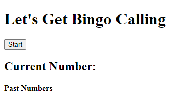
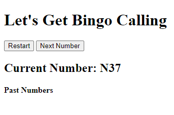
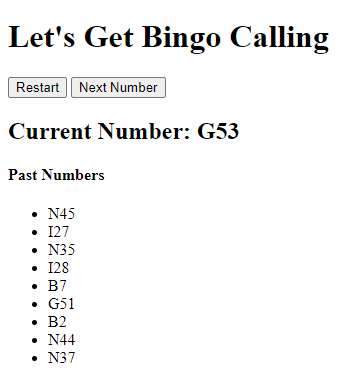

# Bingo Caller

## Table of Contents
- [Project Overview](#project-overview)
- [Live Application](#live-application)
- [License](#license)
- [Screenshots](#screenshots)

## Project Overview
Client-side application that generates a random bingo number from an array until all 75 numbers have been called. Local storage persists the current number, past numbers, and available numbers to pull from between sessions. Built using JavaScript, HTML, and CSS.

[View the live application](https://captain63.github.io/bingo-caller/).

### Languages Used
- JavaScript
- HTML
- CSS

## Live Application
[View deployed application](https://captain63.github.io/bingo-caller/).

## License
Permission is hereby granted, free of charge, to any person obtaining a copy of this Software and associated documentation files (the "Software"), to deal in the Software without  restriction, including without limitation the rights to use, copy, modify, merge, publish distribute, sublicense, and/or sell copies of the Software, and to permit persons to whom the Software is furnished to do so, subject to the following conditions.

[View the full license](./LICENSE).

## Screenshots
### Initial view

### First number generated

### Past numbers populated
